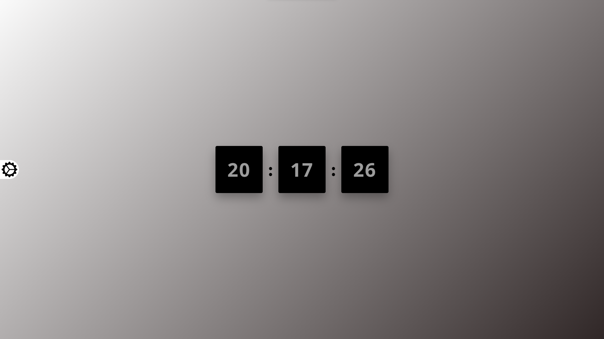
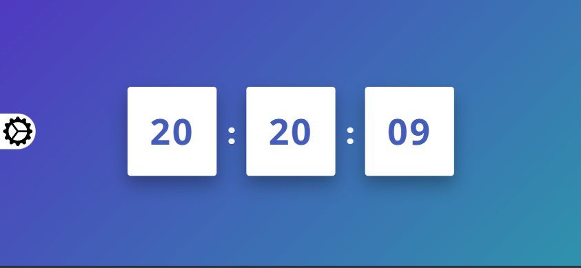

# Clock 🕒

A minimal digital clock made with **HTML**, **CSS**, and **JavaScript**.

## 🔥 Features

- Real-time clock
- Smooth animation
- Responsive design

## 🖼️ Preview

## 🚀 How to Use

Just open the `index.html` file in your browser. No setup needed!

---

Made with 💙 by [Elman](https://github.com/Elman13)
